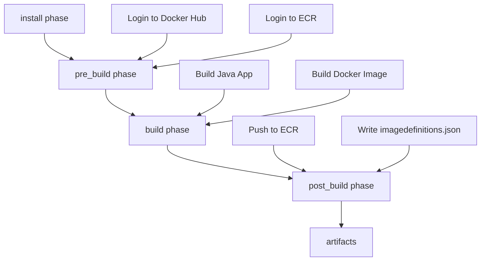
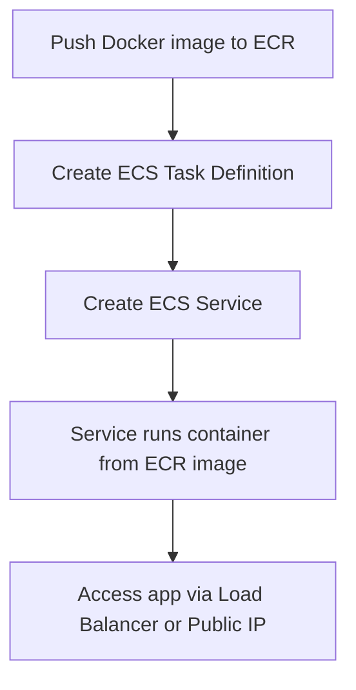

# DevSpace

DevSpace is a professional, full-featured social media web application designed specifically for developers. Built with Java 21, Spring Boot MVC, Thymeleaf, and H2 Database, it follows a strict MVC architecture with server-side rendering and a modern, responsive UI using Tailwind CSS.

## Features
- User registration, login, and logout
- Create, view, and display posts (text-based, image support planned)
- View user profiles and their posts
- Comment on posts
- Like/react to posts
- Follow and unfollow other users
- Responsive, modern UI (Tailwind CSS)

## Tech Stack
- Java 21
- Spring Boot (MVC, Security, Data JPA, Events)
- Thymeleaf (server-side rendering)
- H2 Database (in-memory, for development)
- Tailwind CSS (CDN)

## Architecture
DevSpace is built using the MVC (Model-View-Controller) pattern:
- **Model:** JPA entities (`User`, `Post`, `Comment`, `Like`, `Follow`) and repositories
- **View:** Thymeleaf templates in `src/main/resources/templates/` with Tailwind CSS for styling
- **Controller:** Spring MVC controllers handle HTTP requests, interact with services, and render views
- **Service:** Business logic and integration with repositories
- **Event-driven:** Uses Spring events for extensibility (e.g., notifications)

## Setup & Running
1. **Clone the repository:**
   ```sh
   git clone <repo-url>
   cd devspace
   ```
2. **Build and run the application:**
   ```sh
   ./mvnw spring-boot:run
   ```
3. **Access the app:**
   - Open [http://localhost:8080](http://localhost:8080) in your browser
   - H2 Console: [http://localhost:8080/h2-console](http://localhost:8080/h2-console) (JDBC URL: `jdbc:h2:mem:devspace`)

## Usage
- Register a new account or log in with existing credentials
- Create posts from the home page
- View and interact with posts (like, comment)
- Visit user profiles to see their posts and follow/unfollow

## Directory Structure
```
src/main/java/org/frank/devspace/
  model/         # JPA entities
  repository/    # Spring Data JPA repositories
  service/       # Business logic and user details
  controller/    # MVC controllers
  config/        # Security and app config
src/main/resources/templates/  # Thymeleaf views
src/main/resources/static/     # Static assets (CSS, JS)
```

## Extending DevSpace
- Add new features by creating new models, controllers, and views
- Use Spring events for notifications or analytics
- Replace H2 with a production database (e.g., PostgreSQL) for deployment


## To AWS
- [./images/flow_aws.png](./images/flow_aws.png)

#### Continous Integration Step

   - the application
   - dockerise it
   -  ecr
      - create a resigry
   - buildspec.yml
   - aws code build
      - modify the service role (attach policies = container registry full access and power user)
      - create env variables for the docke credentials in there

```text
The buildspec sets up Java and Maven.
Logs in to Docker Hub (to pull base images) and ECR (to push your app image).
Builds your Java app and Docker image.
Pushes the image to ECR.
Prepares a file for ECS to deploy the new image.
```




- visit the registry, the image should be there


#### Continuous Delivery & Continuous Deployment

- create the ecs infrastructure
   - tasks definition
      - container details (you can use the registry repository name, just to be consistent, by default it will take the latest image, given the registry repository uri)
      - expose 8080

   - cluster -> service
      - specify a name
      - you realise that no task is running
         - you can map task directly to the cluster (or)
         - create a service and map the task to that particular service
            - so create a service
            - chooe launch type compute configuration (fargate)
            - networking - create a new security Group (all traffic, all tcp, source: anywhere)

   - run definition





## License
MIT 